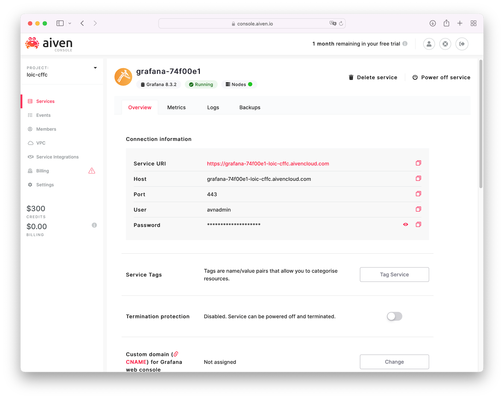

<div align="center">

# Aiven Kafka quickstart with nodeJS

The following is a walkthrough for setting up and using Apache Kafka on Aiven. We will use a sample nodeJS app to push mock IoT sensor data to an Aiven Kafka. Aiven Kafka is a **fully managed Kafka service** enabling your distributed event streaming pipeline with zero vendor lock-in.

[Summary](#summary) •
[Getting started](#getting-started) •
[Streaming mock messages](#streaming-mock-messages) •
[Viewing messages](#viewing-messages) •
[Notes](#notes) •
[Why Aiven?](#why-aiven) •
[(Optional) Monitoring](#optional-monitoring)

</div>

<br>

## Summary

- Deploy a Kafka instance on Aiven
- Stream IoT messages with `index.js`
- View streamed messages
- View relevant metrics

<br>

<div align="center">


</div>

<br>

## Getting started
<br>

### *Step 1: Prepare your local environement*

This tutorial is based on the `node-rdkafka` npm package, a Node.js binding for the C/C++ library `librdkafka`. 
Make sure you have an OpenSSL version available for the `node-rdkafka` compiler to use:

```sh
# Making sure OpenSSL is installed, by default macOS used LibreSSL
brew install openssl

# Allow the node compiler to access OpenSSL
export CPPFLAGS=-I/usr/local/opt/openssl/include\nexport
export LDFLAGS=-L/usr/local/opt/openssl/lib
```

You can now install the project node packages in `node-kafka-aiven-quickstart/`
```sh
npm install          # Compiling and installing node-rdkafka and yargs
```

<br>

### *Step 2: Deploy your Aiven Apache Kafka service*
<br>

If you don't already have an Aiven account, register to [Aiven](https://console.aiven.io/signup.html). This Aiven Kafka quickstart for NodeJS will walk you trough a mock IoT sensors flock streaming data to your Aiven Kafka managed service.


Select **Create a new service** and create an Apache Kafka instance. Note that the service name cannot be changed afterwards. Aiven will provide you with a monthly cost estimation.


Optional: customize your cloud provider, region, storage and Kafka nodes.


Once the Kafka instance is fully deployed, create a topic matching with your producer. In our example we'll use `iotSensors`


Download your Kafka instance Access Key, Access Certificate, and CA Certificate to send SSL-secured messages from the producer. Activate the REST interface.


## Streaming mock messages

Run the nodeJS app to push messages from the producer by passing your Kafka instance as parameter:
<br>

```sh
node index.js \
    --host kafka-1cebc772-loic-cffc.aivencloud.com:13301  \
    --key-path service.key \
    --cert-path service.cert \
    --ca-path ca.pem
```

Messages are pushed to your Kafka instance. Amount of mock IoT messages can be modified in `index.js` > `let numEvents = 100;`


## Viewing messages

Messages are accessible from your Aiven console in `Services` > `Kafka instance name` > `Topics` > `Topic name` > `Messages` > `Fetch Messages`
Messages can be in binary, JSON or ARVO format.


<br>

## Notes

- Alternatives to nodeJS Kafka packages are `Kafka-Node`, `Kafka-Rest-Client`. See [NPM Compare](https://npmcompare.com/compare/kafka-node,kafka-rest-client,node-rdkafka)
- By default librdkafka itself does not provide serialization or schema-registry support, this can be provided by Confluent's libserdes which can be used in combination with librdkafka to serialize/deserialize Avro with schemas registered in the Schema-registry
- You can pass multiple configuration options to librdkafka. A full list can be found in librdkafka's [Configuration.md](https://github.com/edenhill/librdkafka/blob/v1.7.0/CONFIGURATION.md)


<br>

## Why Aiven?

Aiven enables a Apache Kafka deployment as a fully managed service, with zero vendor lock-in and a full set of capabilities to build your streaming pipeline.

+ Automatic updates and upgrades
+ Transparent pricing. No networking costs
+ 99.99% uptime. 100% human support
+ Scale up or scale down as you need

<br>

## (Optional) Monitoring

To setup metric collection and a visualisation dashboard for our Kafka instance, we will deploy the following:
- Aiven for InfluxDB / PostgreSQL - Database where the telemetry data is stored and can be queried from
- Aiven for Grafana - Dashboards for the telemetry data

The underlying storage for the telemetry data will be InfluxDB. It is a time-series database with interesting features:
- Fast adaptive compression algorithms allow storing huge numbers of data points
- Individual metrics data points can be tagged with key=value tags and queried based on them
- Advanced query language allows queries whose output data requires little or no post-processing

Deploy your Aiven InfluxDB and Grafana instance and make sure the services are deployed


Aiven automatically provides basic host-level resource metrics (CPU, memory, disk and network) for every service under the "Metrics" tab in the service view of the Aiven web console. In your Kafka instance, Enable metric integration


As we have deployed an InfluxDB, select your InfluxDB service


Next you can enable the Grafana dashboard integration


Select your deployed Grafana service


Both integrations are now set up


Access your Grafana through the provided URL to visualise the dashboard


In Grafana, browse your available dashboard and select your Kafka ressource


You can now visualise your Kafka metrics, monitor them and set automatic alerts

